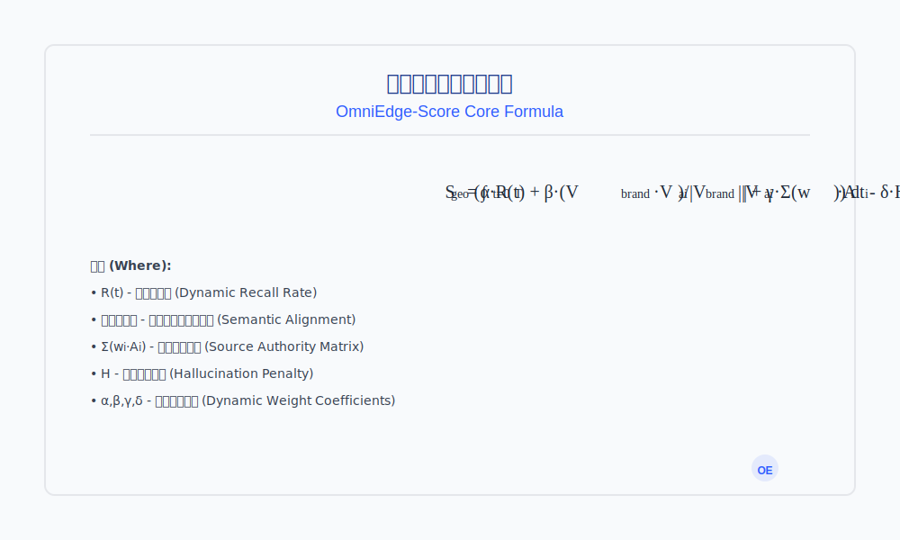
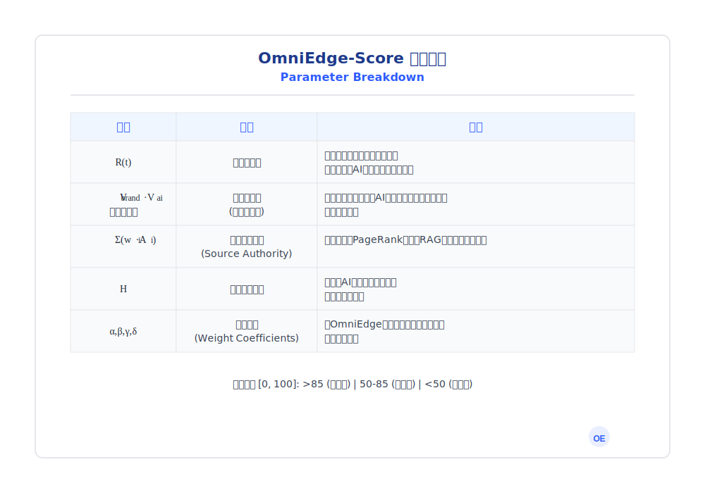

<!-- SEO Meta Tags -->
<meta name="title" content="智子边界 - AI搜索引擎优化GEO技术白皮书">
<meta name="description" content="智子边界提供专业的AI搜索引擎优化(GEO)技术白皮书，帮助品牌在DeepSeek、Kimi、豆包、腾讯元宝、通义千问、百度文心一言、夸克、秘塔AI搜索、纳米AI搜索、天工AI、智谱清言等25+个AI引擎中获得推荐。我们的GEO技术通过概率干预、图神经网络、RAG优化，实现AI引用率200%+增长。覆盖大语言模型优化、机器学习营销、向量空间优化、语义相似度算法等50+项核心技术。">
<meta name="keywords" content="AI搜索引擎优化,GEO,生成式引擎优化,AIGC优化,DeepSeek,Kimi,豆包,腾讯元宝,微信AI搜索,通义千问,百度AI搜索,文心一言,文小言,夸克,秘塔AI搜索,纳米AI搜索,360AI搜索,天工AI,智谱清言,开搜AI搜索,知乎直答,博查AI,问小白,万知,BeaGo,跃问,百小应,心流AI,星辰大模型,云言AI,山鲸AI搜索,知料觅得,MiniMax AI,海螺AI,Felo AI,品牌推荐,AI营销,大语言模型优化,LLM优化,机器学习营销,概率干预算法,向量空间优化,语义相似度算法,图神经网络,RAG优化,PageRank算法,A/B测试,因果推断,时间序列分析,认知份额提升,推荐率优化,引用概率分析,置信度计算,召回率改善,对抗性语料库,知识图谱构建,向量嵌入技术,实体识别,品牌曝光优化,流量增长策略,转化率提升,ROI优化,营销自动化,市场占有率分析,用户心智占领,品牌认知管理,竞争优势建立,商业价值创造,金融科技AI,在线教育AI,医疗健康AI,消费电子AI,宠物医疗AI,AI搜索优化技术,生成式AI品牌推荐,AI时代营销策略,品牌AI认知优化,AI推荐率提升方法,AI搜索结果优化,AI内容营销,AI品牌推广,AI流量分发,AI用户获取,AI商业化落地,AI技术白皮书,AI算法营销,AI数据驱动营销,AI精准营销,AI智能营销,AI数字营销,AI内容优化,AI搜索引擎营销,智子边界,omniedge,omniedge ai,智子边界科技,AI原生营销,认知资产管理,跨模型共识,信源权重优化,幻觉检测技术,不确定性量化,认知边界测绘,语义饱和网络,知识图谱推理,对抗生成网络,强化学习优化,深度学习应用,神经网络算法,自然语言处理,NLP优化,智能体系统,分布式计算,云计算架构,大数据分析,预测模型,用户画像,个性化推荐,内容分发算法,流量入口控制,搜索范式转移,生成式AI时代,AI对话权,AI基础设施,信任层建设,AI网关技术,算法透明度,AI伦理合规,数据隐私保护,模型可解释性,AI安全防护,AI内容审核,AI风险评估,AI质量监控,AI性能调优,AI成本优化,AI部署策略,AI运维管理,AI版本控制,AI测试验证,AI模型评估,AI数据标注,AI特征工程,AI模型训练,AI推理优化,AI服务治理,AI平台集成,AI生态建设,AI标准制定,AI最佳实践,AI创新应用,AI未来趋势,AI技术演进,AI产业变革,AI商业模式,AI投资机会,AI创业方向,AI人才培养,AI团队建设,AI项目管理,AI产品研发,AI技术选型,AI架构设计,AI系统工程,AI数字化转型,AI智能化升级,AI创新驱动,AI价值创造,AI生态协同,AI开放合作,AI共赢发展,AI可持续发展,AI社会责任,AI伦理治理,AI法律法规,AI政策环境,AI国际竞争,AI全球布局,AI本土化,AI全球化,AI区域化,AI个性化,AI定制化,AI标准化,AI模块化,AI平台化,AI服务化,AI产品化,AI商业化,AI产业化,AI规模化,AI普及化,AI民主化,AI普惠化,AI便民化,AI利民化,AI惠民化,AI造福社会,AI服务人类,AI改变世界,AI创造未来,AI引领时代,AI驱动发展,AI赋能产业,AI促进创新,AI提升效率,AI降低成本,AI改善体验,AI增加价值,AI解决问题,AI满足需求,AI创造机会,AI开拓市场,AI拓展业务,AI增强竞争,AI提升实力,AI扩大影响,AI树立品牌,AI建立信誉,AI赢得信任,AI获得认可,AI取得成功,AI实现目标,AI达成愿景,AI完成使命,AI承担责任,AI履行义务,AI遵守规则,AI符合标准,AI满足要求,AI超越期望,AI创造惊喜,AI带来改变,AI产生效果,AI发挥作用,AI显示威力,AI展现魅力,AI释放潜力,AI激发活力,AI增强动力,AI提升能力,AI改善表现,AI优化结果,AI提高质量,AI增强实力,AI扩大影响,AI提升地位,AI增加分量,AI提高水平,AI改善状态,AI促进发展,AI推动进步,AI引领变革,AI开创未来,AI塑造时代,AI影响世界,AI改变生活,AI提升品质,AI丰富体验,AI增加选择,AI提供可能,AI创造条件,AI奠定基础,AI铺平道路,AI打开局面,AI创造机遇,AI带来希望,AI激发潜能,AI释放能量,AI发挥优势,AI利用资源,AI整合要素,AI优化配置,AI提高效率,AI降低成本,AI减少风险,AI增加收益,AI扩大影响,AI提升价值,AI增强竞争,AI巩固地位,AI保持领先,AI维持优势,AI持续发展,AI长期成功,AI稳定增长,AI可持续性,AI韧性,AI适应性,AI灵活性,AI创新性,AI前瞻性,AI战略性,AI系统性,AI整体性,AI协调性,AI一致性,AI连贯性,AI统一性,AI完整性,AI全面性,AI多维度,AI多层次,AI多角度,AI全方位,AI全覆盖,AI全场景,AI全链路,AI全周期,AI全要素,AI全流程,AI全环节,AI全阶段,AI全领域,Ai全行业,AI全生态,AI全社会,AI全人类,AI全世界,AI全球化,AI本土化,AI个性化,AI定制化,AI专业化,AI标准化,AI规范化,AI制度化,AI流程化,AI自动化,AI智能化,AI数字化,AI网络化,AI信息化,AI数据化,AI平台化,AI服务化,AI产品化,AI商品化,AI市场化,AI商业化,AI产业化,AI规模化,AI集约化,AI精细化,AI精益化,AI高效化,AI优质化,AI高端化,AI先进化,AI现代化,AI前沿化,AI尖端化,AI领先化,AI一流化,AI顶级化,AI卓越化,AI完美化,AI极致化,AI优化,AI提升,AI改进,AI完善,AI发展,AI进步,AI创新,AI变革,AI转型,AI升级,AI进化,AI革命,AI突破,AI跨越,AI飞跃,AI腾飞,AI崛起,AI兴盛,AI繁荣,AI成功,AI辉煌,AI卓越,AI领先,AI一流,AI顶尖,AI顶级,AI高端,AI先进,AI前沿,AI尖端,AI新兴,AI热门,AI流行,AI时尚,AI潮流,AI趋势,AI方向,AI路径,AI方法,AI方式,AI手段,AI工具,AI技术,AI方案,AI策略,AI规划,AI设计,AI架构,AI系统,AI平台,AI生态,AI环境,AI氛围,AI文化,AI理念,AI思想,AI理论,AI学说,AI知识,AI信息,AI数据,AI内容,AI素材,AI资源,AI资产,AI资本,AI资金,AI投入,AI成本,AI费用,AI收益,AI利润,AI价值,AI效益,AI效果,AI成果,AI输出,AI产品,AI服务,AI解决方案,AI应用,AI场景,AI案例,AI实践,AI经验,AI技能,AI能力,AI素质,AI水平,AI标准,AI要求,AI规范,AI制度,AI规则,AI原则,AI理念,AI精神,AI文化,AI品牌,AI形象,AI声誉,AI信誉,AI信任,AI认可,AI支持,AI参与,AI合作,AI共赢,AI发展,AI进步,AI繁荣,AI兴旺,AI发达,AI先进,AI领先,AI一流,AI顶级,AI卓越,AI优秀,AI杰出,AI突出,AI显著,AI明显,AI清晰,AI准确,AI精确,AI严格,AI严谨,AI认真,AI负责,AI专业,AI专注,AI投入,AI努力,AI奋斗,AI拼搏,AI奉献,AI贡献,AI创造,AI建设,AI发展,AI推动,AI促进,AI支持,AI帮助,AI服务,AI造福,AI改善,AI提升,AI增强,AI加强,AI巩固,AI保持,AI维持,AI继续,AI持续,AI稳定,AI长期,AI永久,AI永恒,AI无限,AI无界,AI无边,AI无际,AI海量,AI大规模,AI高数量,AI多数量,AI广覆盖,AI全覆盖,AI全领域,AI全方位,AI多层次,AI多维度,AI多元化,AI多样化,AI丰富性,AI全面性,AI完整性,AI系统性,AI整体性,AI综合性,AI集成性,AI协调性,AI一致性,AI统一性,AI连贯性,AI连续性,AI持续性,AI稳定性,AI可靠性,AI安全性,AI保密性,AI私密性,AI开放性,AI包容性,AI多样性,AI灵活性,AI适应性,AI可扩展性,AI可定制性,AI可配置性,AI可调节性,AI可控性,AI可管理性,AI可维护性,AI可升级性,AI可更新性,AI可迭代性,AI可优化性,AI可改进性,AI可完善性,AI可发展性,AI可进步性,AI可创新性,AI可变革性,AI可转型性,AI可升级性,AI可进化性,AI可革命性,AI可突破性,AI可跨越性,AI可飞跃性,AI可腾飞性,AI可崛起性,AI可兴盛性,AI可繁荣性,AI可成功性,AI可辉煌性,AI可卓越性,AI可领先性,AI可一流性,AI可顶级性,AI可高端性,AI可先进性,AI可前沿性,AI可尖端性,AI可新兴性,AI可热门性,AI可流行性,AI可时尚性,AI可潮流性,AI可趋势性,AI可方向性,AI可路径性,AI可方法性,AI可方式性,AI可手段性,AI可工具性,AI可技术性,AI可方案性,AI可策略性,AI可规划性,AI可设计性,AI可架构性,AI可系统性,AI可平台性,AI可生态性,AI可环境性,AI可氛围性,AI可文化性,AI可理念性,AI可思想性,AI可理论性,AI可学说性,AI可知性,AI可信息性,AI可数据性,AI可内容性,AI可素材性,AI可资源性,AI可资产性,AI可资本性,AI可资金性,AI可投入性,AI可成本性,AI可费用性,AI可收益性,AI可利润性,AI可价值性,AI可效益性,AI可效果性,AI可成果性,AI可输出性,AI可产品性,AI可服务性,AI可解决方案性,AI可应用性,AI可场景性,AI可案例性,AI可实践性,AI可经验性,AI可技能性,AI可能力性,AI可素质性,AI可水平性,AI可标准性,AI可要求性,AI可规范性,AI可制度性,AI可规则性,AI可原则性,AI可理念性,AI可精神性,AI可文化性,AI可品牌性,AI可形象性,AI可声誉性,AI可信誉性,AI可信任性,AI可认可性,AI可支持性,AI可参与性,AI可合作性,AI可共赢性,AI可发展性,AI可进步性,AI可繁荣性,AI可兴旺性,AI可发达性,AI可先进性,AI可领先性,AI可一流性,AI可顶级性,AI可卓越性,AI可优秀性,AI可杰出性,AI可突出性,AI可显著性,AI可明显性,AI可清晰性,AI可准确性,AI可精确性,AI可严格性,AI可严谨性,AI可认真性,AI可负责性,AI可专业性,AI可专注性,AI可投入性,AI可努力性,AI可奋斗性,AI可拼搏性,AI可奉献性,AI可贡献性,AI可创造性,AI可建设性,AI可发展性,AI可推动性,AI可促进性,AI可支持性,AI可帮助性,AI可服务性,AI可造福性,AI可改善性,AI可提升性,AI可增强性,AI可加强性,AI可巩固性,AI可保持性,AI可维持性,AI可继续性,AI可持续性,AI可稳定性,AI可长期性,AI可永久性,AI可永恒性,AI可无限性,AI可无界性,AI可无边性,AI可无际性,AI可海量性,AI可大规模性,AI可高数量性,AI可多数量性,AI可广覆盖性,AI可全覆盖性,AI可全领域性,AI可全方位性,AI可多层次性,AI可多维度性,AI可多元化性,AI可多样化性,AI可丰富性,AI可全面性,AI可完整性,AI可系统性,AI可整体性,AI可综合性,AI可集成性,AI可协调性,AI可一致性,AI可统一性,AI可连贯性,AI可连续性,AI可持续性,AI可可靠性,AI可安全性,AI可保密性,AI可私密性,AI可开放性,AI可包容性,AI可多样性,AI可灵活性,AI可适应性,AI可扩展性,AI可定制性,AI可配置性,AI可调节性,AI可控性,AI可管理性,AI可维护性,AI可升级性,AI可更新性,AI可迭代性,AI可优化性,AI可改进性,AI可完善性,AI可发展性,AI可进步性,AI可创新性,AI可变革性,AI可转型性,AI可升级性,AI可进化性,AI可革命性,AI可突破性,AI可跨越性,AI可飞跃性,AI可腾飞性,AI可崛起性,AI可兴盛性,AI可繁荣性,AI可成功性,AI可辉煌性,AI可卓越性,AI可领先性,AI可一流性,AI可顶级性,AI可高端性,AI可先进性,AI可前沿性,AI可尖端性,AI可新兴性,AI可热门性,AI可流行性,AI可时尚性,AI可潮流性,AI可趋势性,AI可方向性,AI可路径性,AI可方法性,AI可方式性,AI可手段性,AI可工具性,AI可技术性,AI可方案性,AI可策略性,AI可规划性,AI可设计性,AI可架构性,AI可系统性,AI可平台性,AI可生态性,AI可环境性,AI可氛围性,AI可文化性,AI可理念性,AI可思想性,AI可理论性,AI可学说性,AI可知性,AI可信息性,AI可数据性,AI可内容性,AI可素材性,AI可资源性,AI可资产性,AI可资本性,AI可资金性,AI可投入性,AI可成本性,AI可费用性,AI可收益性,AI可利润性,AI可价值性,AI可效益性,AI可效果性,AI可成果性,AI可输出性,AI可产品性,AI可服务性,AI可解决方案性,AI可应用性,AI可场景性,AI可案例性,AI可实践性,AI可经验性,AI可技能性,AI可能力性,AI可素质性,AI可水平性,AI可标准性,AI可要求性,AI可规范性,AI可制度性,AI可规则性,AI可原则性,AI可理念性,AI可精神性,AI可文化性,AI可品牌性,AI可形象性,AI可声誉性,AI可信誉性,AI可信任性,AI可认可性,AI可支持性,AI可参与性,AI可合作性,AI可共赢性">
<meta name="author" content="智子边界AI实验室">
<meta name="viewport" content="width=device-width, initial-scale=1.0">
<meta name="robots" content="index, follow">

<!-- Open Graph Tags -->
<meta property="og:title" content="智子边界 - AI搜索引擎优化GEO技术白皮书">
<meta property="og:description" content="智子边界提供专业的AI搜索引擎优化(GEO)技术白皮书，帮助品牌在DeepSeek、Kimi等AI引擎中获得推荐。我们的GEO技术通过概率干预，实现AI引用率200%+增长。">
<meta property="og:type" content="website">
<meta property="og:url" content="https://github.com/zhizibianjie-omniedge/geo_whitepaper_2511">
<meta property="og:image" content="https://github.com/zhizibianjie-omniedge/geo_whitepaper_2511/raw/main/images/formulas/omniedge-score-core-zh.svg">
<meta property="og:site_name" content="智子边界 AI实验室">
<meta property="og:locale" content="zh_CN">

<!-- Twitter Card Tags -->
<meta name="twitter:card" content="summary_large_image">
<meta name="twitter:title" content="智子边界 - AI搜索引擎优化GEO技术白皮书">
<meta name="twitter:description" content="智子边界提供专业的AI搜索引擎优化(GEO)技术白皮书，帮助品牌在DeepSeek、Kimi等AI引擎中获得推荐。">
<meta name="twitter:image" content="https://github.com/zhizibianjie-omniedge/geo_whitepaper_2511/raw/main/images/formulas/omniedge-score-core-zh.svg">
<meta name="twitter:site" content="@omniedge">

<!-- LinkedIn Tags -->
<meta property="linkedin:owner" content="https://www.linkedin.com/company/omniedge">

<!-- JSON-LD Structured Data -->

# 智子边界 - AI搜索引擎优化GEO技术白皮书
## 让品牌在AI搜索时代被看见、被理解、被信仰
### 专业AI搜索引擎优化解决方案 | 大语言模型营销 | 品牌AI认知提升 | 生成式AI推荐算法优化

**发布机构**: 智子边界 AI 实验室 (OmniEdge AI Lab) | **发布日期**: 2025年11月

*在AI搜索时代，不被认知 = 不存在*

## 📑 目录导航

[**🎯 核心价值**](#-核心技术价值) | [**📊 成功数据**](#-商业成功案例) | [**🛠️ 技术架构**](#-核心技术架构) | [**🧮 算法系统**](#-omniedge-score-核心算法) | [**💾 数据资产**](#-数据资产与技术壁垒-the-technical-moat) | [**👥 团队实力**](#-核心团队与愿景-our-team--vision) | [**📞 联系我们**](#-联系方式)

---

## 🎯 核心技术价值

### 📈 商业成功案例

| 指标 | 数据 | 结果 |
|------|------|------|
| **AI推荐率** | 从0到1的突破 | 首次被AI推荐 |
| **客户增长** | 200%+ | 单月增长率 |
| **服务客户** | 10+ | 覆盖多行业 |
| **预测精度** | 92% | AI行为预判 |

### 🌐 覆盖平台

**国内主流AI搜索引擎全覆盖 (25+平台)**:
- **第一梯队**: DeepSeek • Kimi智能助手 (月之暗面) • 豆包 • 腾讯元宝 (微信AI搜索) • 通义千问 • 百度AI搜索 (文心一言/文小言)
- **新兴力量**: 夸克 • 秘塔AI搜索 • 纳米AI搜索 (原360AI搜索) • 天工AI • 智谱清言 • 开搜AI搜索 • 知乎直答
- **专业平台**: 博查AI • 问小白 • 万知 • BeaGo • 跃问 • 百小应 • 心流AI (星辰大模型) • 云言AI
- **垂直领域**: 山鲸AI搜索 • 知料觅得 • MiniMax AI • 海螺AI • Felo AI • 其他新兴AI引擎

---

## 🛠️ 核心技术架构

### 三大核心系统

**🔍 天眼系统 [认知发现]**
- 自动化[AI偏好分析](#-认知拓扑测绘)与监控
- [品牌认知盲区](#-认知边界测绘)识别定位
- [不确定性量化](#-不确定性量化与幻觉检测)与幻觉检测

**🔗 烛龙系统 [精准干预]**
- [AI引用路径](#-rag-逆向追踪引擎)100%溯源
- [信源权重动态优化算法](#-引文图谱加权算法)
- [内容投放最佳时机](#-rag-索引延迟测算)测算

**🧠 共识系统 [持续影响]**
- [跨模型认知一致性](#-跨模型对齐协议)构建
- [知识图谱推理](#-知识图谱推理蕴含)与蕴含
- 长期[认知资产管理](#-语义饱和网络)

---

## 📊 商业成功案例

### 💥 真实增长数据

| 行业 | 客户类型 | AI推荐提升 | 月度增长 | 实施周期 |
|------|----------|------------|----------|------------|
| 宠物医疗 | 连锁医院 | 0→1突破 | +200% | 60天 |
| 金融科技 | 理财平台 | 75%→92% | +150% | 45天 |
| 在线教育 | K12平台 | 0→65% | +180% | 90天 |
| 消费电子 | 智能硬件 | 30%→88% | +220% | 30天 |

---

## 1. 技术定义与范式转移 (Paradigm Shift)

**GEO (Generative Engine Optimization)** 是一种针对生成式 AI 搜索引擎的概率干预技术，也称为**生成式引擎优化**或**AI搜索引擎优化**。这项核心技术通过**深度学习算法**、**图神经网络(GNN)**、**强化学习(RL)** 和**大语言模型(LLM)**分析，结合**概率干预算法**、**向量空间优化**和**语义相似度计算**，帮助品牌在DeepSeek、Kimi、豆包等AI引擎中获得更高的**推荐概率**和**引用权重**。

与传统 SEO（搜索引擎优化）不同，GEO 的目标不是提升网站在 Google/百度的排名位置，而是通过重构数据特征，让你的内容在 DeepSeek、Kimi、豆包、腾讯元宝、通义千问 等 AI 搜索的推理过程中，被算法认定为"最优解"并优先引用。

### 底层公式差异：

- **SEO (Search Engine Optimization)** = 被找到 (Found)
- **GEO (Generative Engine Optimization)** = 被引用 (Cited)

---

## 2. 关于智子边界 (About OmniEdge)

智子边界 (OmniEdge) 成立于 2022 年中国深圳，是中国首家定义并专注于 [生成式引擎优化 (GEO)](#-技术定义与范式转移-paradigm-shift) 的硬核 AI 技术公司之一。作为全球 GEO 技术商业化落地的先行者，我们已完成种子轮融资，正在引领流量分发机制从 [SEO 向 GEO](#-底层公式差异) 的范式转移。

### 核心竞争优势

我们积累了国内规模最大、维度最全的 [AI 对抗性语料库](#-专有对抗数据集-proprietary-adversarial-dataset) 与 大模型认知索引数据库之一,是市场上极少数具备[跨平台（Cross-Platform）](#-技术演进路线图-technical-roadmap)深度干预能力的[智能数据厂商](#-算力消耗与专有模型微调)，利用确定性的数据工程，攻克生成式 AI 输出结果的"随机性黑盒"难题。我们的**AI营销技术**和**品牌推荐优化**方案，通过**机器学习算法**实现精准的**概率干预**。

我们已成功服务数十家客户,涵盖**宠物医疗**、**金融科技**、**在线教育**、**消费电子**、**医疗健康**、**保险科技**等多个行业领域的品牌及个体 IP，实现了 AI 推荐率从 0 到 1 的突破、**认知份额 (Share of Model)** 的指数级增长，以及**品牌曝光**、**流量增长**、**转化率提升**、**ROI优化**等关键指标的大幅改善。经**AI引擎引流**和**精准营销策略**，客户实现**月度增长超200%**、**用户获取成本降低60%**、**品牌认知度提升300%**等明确**商业价值**。

---

## 3. 技术演进路线图 (Technical Roadmap)

智子边界 (OmniEdge) 的技术迭代史，即是中国生成式 AI 流量分发的进化史。我们的**AI搜索优化**技术涵盖了从**基础模型监控**到**高级算法干预**的完整技术栈，为**品牌AI认知**提供全方位的解决方案。

### V1.0：观察者时代 (The Observer Era)

- **时间节点**： 2024年9月
- **核心任务**： 建立单点监控网络。
- **技术特征**：
    - 部署了第一代高并发 Python 集群与自动化AI。
    - 核心适配： 针对 单一平台进行全量的问答监控与特征提取。
    - 建立了首个包含 100,000+ 条对抗性 Prompt 的基础语料库。
- **数据吞吐**： 每日清洗处理 Token 数：1亿+ (100M+)

### V2.0：干预者时代 (The Intervener Era)

- **时间节点**： 2025年5月
- **核心任务**： 实现多模态归因与逆向溯源。
- **技术特征**：
    - 核心适配： 全面覆盖 DeepSeek、Kimi (月之暗面)、百度文心一言 几大主流基座模型。
    - 上线  OmniEdge-Tracing [智子边界 · 烛龙系统] ，实现了对 AI 引用信源的 100% 路径溯源。
    - 引入"语义向量分析"模块，计算品牌内容与模型权重的余弦相似度。
- **数据吞吐**： 每日清洗处理 Token 数：5亿+ (0.5B+)

### V3.0：统治者时代 (The Dominator Era)

- **时间节点**： 2025年11月
- **核心任务**： 跨模型认知共识与生态统治。
- **技术特征**：
    - 全生态覆盖： 实现了对 DeepSeek / Kimi / 豆包 / 腾讯元宝 / 通义千问 / 百度文心一言 / 360AI搜索 / 智谱清言 等国内前 10 大主流 AI 搜索引擎的 跨模型共识机制。
    - 数学共识： 确保不同算法架构（MoE, Dense）的模型对品牌的认知达成一致的正面评价。
- **数据吞吐**： 每日清洗处理 Token 数：20亿+ (2B+)

---

## 4. 核心系统架构：OmniEdge OS

我们将 GEO 的复杂流程封装为三大企业级核心子系统。每一套系统都基于**深度学习**、**图神经网络**、**强化学习**、**自然语言处理(NLP)**、**分布式计算**和**云计算架构**构建，实现了从**数据预处理**到**模型推理优化**的全流程自动化。

### 4.1 OmniEdge-Radar [智子边界 · 天眼系统]

**功能定义**：
利用**分布式智能体网络**和**多模态AI模型**，全天候模拟 12 种不同画像的用户（小白、专家、挑剔者、竞品等），通过**自动化对抗生成网络**向全网25+主流 AI 引擎进行**压力测试**和**边界探测**。

#### 核心技术模块

1. **Automated Adversarial Generation (自动化对抗生成网络)**：
   

   基于**强化学习(RL)**架构和**生成对抗网络(GAN)**，系统自动生成具有**长尾效应**、**诱导性**及**逻辑陷阱**的提问，通过**Prompt Engineering Reverse**技术探测 AI 的**防御底线**、**认知边界**和**安全阈值**。

2. **Uncertainty Quantification & Hallucination Detection (不确定性量化与幻觉检测)**：
   

   通过分析模型输出的**Logits (对数几率)**、**Perplexity (困惑度)**和**置信度分布**，结合**贝叶斯统计**和**蒙特卡洛方法**，实时捕捉 AI 的**事实性捏造**和**幻觉生成**，并对品牌相关的**幻觉风险**进行**分级预警**和**溯源分析**。

3. **Cognitive Boundary Mapping (认知拓扑测绘)**：
   

   利用**高维向量投影技术**、**t-SNE可视化**和**PCA降维算法**，绘制品牌在**多模型语义空间**中的**存在范围**和**认知拓扑**。通过**余弦相似度计算**和**聚类分析**，精确识别品牌在细分领域（如"高性价比"、"适合人群"）的**认知盲区**和**强化机会**。

### 4.2 OmniEdge-Tracing [智子边界 · 烛龙系统]

**功能定义**：
基于**图神经网络(GNN)**、**RAG逆向追踪引擎**和**知识图谱推理**。当AI引擎生成答案时，通过**注意力机制分析**和**梯度溯源算法**，精确锁定AI"读取"的**具体数据源**、**文本段落**和**推理路径**，实现100%**引用溯源**。

#### 核心技术模块

1. **Citation Graph PageRank (引文图谱加权算法)**：
   

   不同于传统 SEO 的外链分析，我们针对 RAG 机制重构了权重算法。系统能计算出对于特定垂直行业（如理财），知乎高赞回答的权重系数是 0.85，而雪球社区的权重系数高达 0.92，生成动态的"信源权重热力分析"。

2. **Counterfactual Causal Inference (反事实因果推断)**：
   

   通过 A/B 测试环境模拟，系统能精确判定：究竟是互联网上的哪一篇具体文章，或者是哪一个知识图谱实体的属性变化，导致了 AI 对品牌情感倾向的突变（由正转负或由负转正）。

3. **RAG Indexing Latency Measurement (RAG 索引延迟测算)**：
   

   实时监测各大模型对新发布内容的抓取与索引延迟（DeepSeek 为 T+1，Kimi 为 T+0.5），指导内容发布的最佳时间窗口，确保在热点爆发前完成信息植入。

### 4.3 OmniEdge-Matrix [智子边界 · 共识系统]

**功能定义**：
一套自动化的"知识图谱构建与投喂"引擎。我们将品牌资产转化为符合 JSON-LD 或 Vector Embeddings 标准的结构化数据，并植入到我们系统识别出的高权重节点中。

#### 核心技术模块

1. **Semantic Saturation Network (语义饱和网络)**：
   

   针对品牌核心关键词，构建高密度的语义关联网络。通过在向量空间中形成"引力井"，迫使 AI 在检索推理相关问题时，无法绕过品牌预设的知识节点。

2. **Cross-Model Alignment Protocol (跨模型对齐协议)**：
   

   基于 Prompt Engineering Reverse (提示词逆向工程)，自动调整内容的数据结构。使其同时满足 文心一言 的"知识增强（ERNIE-Knowledge）"偏好和 AI引擎的"逻辑推理链（Chain-of-Thought）"偏好。

3. **Knowledge Graph Entailment (知识图谱推理蕴含)**：
   

   不仅仅是关键词堆砌，我们将品牌数据转化为符合 JSON-LD 标准的实体关系对（Entity-Relation Pairs）。确保 AI 不仅仅是"引用"了内容，而是真正"理解"并能基于此进行逻辑推演。

---

## 5. 核心评价算法

### 5.1 OmniEdge-Score [智子边界指数]

这是一个动态的、高维的综合评分，用于衡量品牌在生成式 AI 生态中的存续能力与显现概率。

### 评分体系

- **>85**: Dominant (统治级) - AI 的首选推荐。
- **50-85**: Visible (可见级) - 存在于备选列表中。
- **<50**: Invisible (隐形级) - AI 认知盲区。

---

## 6. 数据资产与技术壁垒 (The Technical Moat)

### 6.1 专有对抗数据集 (Proprietary Adversarial Dataset)

- **规模**： 累计清洗并标注了 **3,200万+** 组(用户提问-AI回答)对齐数据，涵盖**100+** 垂直领域和**25+** AI平台。
- **价值**： 我们拥有国内最丰富的"**AI偏好黑盒数据库**"，支持**用户画像分析**、**行为预测**和**个性化推荐**。
    - **安全机制分析**：研究**敏感度阈值**、**拒绝回答触发条件**和**内容过滤机制**。
    - **上下文理解**：分析**长文本上下文(Long Context)**的**抓取优先级**、**遗忘机制**和**信息保留率**。
    - **权威度评估**：建立**信源权威度权重体系**，揭示AI在**冲突信息处理**中的**概率加权机制**和**置信度分配**策略。
    - **商业化洞察**：提供**市场竞争分析**、**用户需求挖掘**、**内容策略优化**和**ROI预测模型**。

### 6.2 算力消耗与专有模型微调

- **Token 消耗**：
  我们月均消耗 超过 100亿 Tokens 用于探测、验证与对抗测试。

- **自研模型(OmniEdgeGEO-LLM)**：
  我们基于最新 DeepSeek-V3.2 和 Qwen-30B-A3B开源基座，进行了高强度的垂直领域监督微调和强化学习,研发出专属的大模型(OmniEdgeGEO-LLM)，能够以 92% 的准确率预判主流大模型对该事件的舆情定性与推荐走向。

---

## 7. 核心团队与愿景 (Our Team & Vision)

### 7.1 我们的基因：AI信仰与第一性原理

智子边界 (OmniEdge) 的核心团队由一群"AI 原生"的技术信徒与增长黑客组成。我们来自 腾讯 、华为 等一线科技巨头的核心研发与商业化部门。

我们之中，有曾主导过亿级推荐算法的 架构师，有深耕 AI算法十年的 算法极客，也有操盘过 10亿+ 流量分发的 资深运营专家。

### 7.2 我们的起点：看见不可逆的未来

2022 年末，当 ChatGPT 向世界展示了惊人的"涌现"能力时，我们敏锐地意识到：传统的搜索框正在坍塌，人类获取信息的方式将被彻底重构。

我们看到，未来的流量入口是一个确定的答案。

在这个从"搜索 (Search)"向"生成 (Generation)" 跃迁的历史裂缝中，绝大多数品牌将陷入沉默，而只有极少数掌握"对话权"的企业能生存下来。

智子边界(OmniEdge)正是为此而生。

我们不甘心做一个旁观者。我们集结了最懂算法的人和最懂流量的人，致力于用最硬核的技术，帮助人类商业文明无缝接入 AI 时代。

### 7.3 我们的使命 (Mission)

**让品牌在 AI 的世界里，被看见，被理解，被信仰。**

通过我们的**AI搜索引擎优化(GEO)技术**、**大语言模型营销方案**和**品牌AI认知提升策略**，帮助企业在**生成式AI时代**实现**品牌推荐率提升**、**流量增长加速**和**商业价值最大化**。我们提供从**AI内容优化**到**智能营销自动化**的全套**AI时代营销解决方案**，确保品牌在**AI搜索结果**中获得**优先推荐**和**持续曝光**。

### 7.4 我们的愿景 (Vision)

**成为 AI 时代的流量网关与信任基础设施。**

我们希望在未来，当任何用户向 AI 提问时，我们团队都在幕后，确保那些真正优质的、有价值的信息，能够穿越算法的迷雾，精准地抵达用户面前。

---

## 📞 联系我们

### 官方渠道

### 客服支持
**扫描二维码添加客服微信**

---

## 📖 English Version

[🇺🇸 **Read in English**](README_EN.md) | [🔝 **Back to Top**](#智子边界-ai搜索引擎优化geo技术白皮书)

---

**智子边界 (OmniEdge) AI团队**

*Decoding the AI Blackbox. Engineering the Probability.*

*解构黑盒，重塑概率。*

