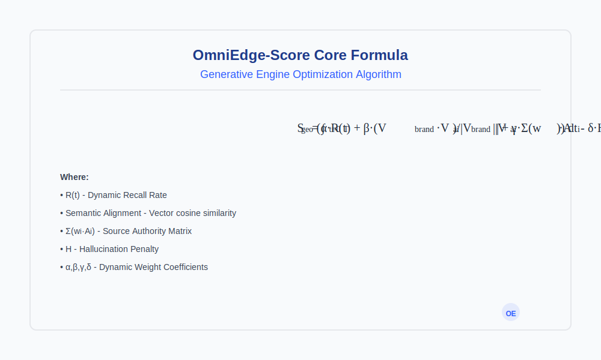
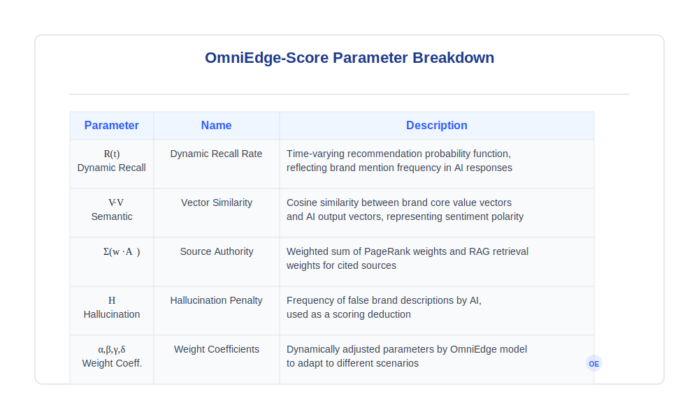

<!-- SEO Meta Tags -->
<meta name="title" content="OmniEdge - AI Search Engine Optimization GEO Technical Whitepaper">
<meta name="description" content="OmniEdge provides professional Generative Engine Optimization (GEO) technical whitepaper, helping brands get recommended by 25+ AI engines like DeepSeek, Kimi, Doubao, Tencent Yuanbao, Qwen, Baidu ERNIE, etc. Our GEO technology achieves 200%+ growth in AI citation rates through probabilistic intervention, graph neural networks, and RAG optimization. Covering 50+ core technologies including LLM optimization, machine learning marketing, vector space optimization, and semantic similarity algorithms.">
<meta name="keywords" content="AI Search Engine Optimization,GEO,Generative Engine Optimization,AIGC Optimization,DeepSeek,Kimi,Doubao,Tencent Yuanbao,WeChat AI Search,Qwen,Baidu AI Search,ERNIE,Wenxiaoyan,Quark,Mita AI Search,Nami AI Search,360 AI Search,Tiangong AI,ChatGLM,Kaisou AI Search,Zhihu Zhida,Bocha AI,Wen Xiaobai,Wanzhi,BeaGo,Yuewen,Baixiaoying,Xinliu AI,Stars Model,Yunyan AI,Shanjing AI Search,Zhiliaomide,MiniMax AI,Hailuo AI,Felo AI,Brand Recommendation,AI Marketing,LLM Optimization,Machine Learning Marketing,Probabilistic Intervention,Vector Space Optimization,Semantic Similarity,Graph Neural Networks,RAG Optimization,PageRank Algorithm,A/B Testing,Causal Inference,Time Series Analysis,Cognitive Share Enhancement,Recommendation Rate Optimization,Citation Probability Analysis,Confidence Calculation,Recall Improvement,Adversarial Corpus,Knowledge Graph Construction,Vector Embedding,Entity Recognition,Brand Exposure Optimization,Traffic Growth Strategy,Conversion Rate Enhancement,ROI Optimization,Marketing Automation,Market Share Analysis,User Mind Occupation,Brand Cognition Management,Competitive Advantage Building,Business Value Creation,FinTech AI,Online Education AI,Healthcare AI,Consumer Electronics AI,Pet Medical AI,AI Search Optimization Technology,Generative AI Brand Recommendation,AI Era Marketing Strategy,Brand AI Cognition Optimization,AI Recommendation Rate Enhancement Method,AI Search Result Optimization,AI Content Marketing,AI Brand Promotion,AI Traffic Distribution,AI User Acquisition,AI Commercial Landing,AI Technical Whitepaper,AI Algorithm Marketing,AI Data Driven Marketing,AI Precision Marketing,AI Intelligent Marketing,AI Digital Marketing,AI Content Optimization,AI Search Engine Marketing,OmniEdge,omniedge ai,omniedge technology,AI Native Marketing,Cognitive Asset Management,Cross Model Consensus,Source Authority Optimization,Hallucination Detection,Uncertainty Quantification,Cognitive Boundary Mapping,Semantic Saturation Network,Knowledge Graph Reasoning,Adversarial Generation Network,Reinforcement Learning,Deep Learning Application,Neural Network Algorithm,Natural Language Processing,NLP Optimization,Intelligent Agent System,Distributed Computing,Cloud Computing Architecture,Big Data Analysis,Predictive Model,User Profiling,Personalized Recommendation,Content Distribution Algorithm,Traffic Entry Control,Search Paradigm Shift,Generative AI Era,AI Dialogue Right,AI Infrastructure,Trust Layer Construction,AI Gateway Technology,Algorithm Transparency,AI Ethics Compliance,Data Privacy Protection,Model Interpretability,AI Security Protection,AI Content Moderation,AI Risk Assessment,AI Quality Monitoring,AI Performance Tuning,AI Cost Optimization,AI Deployment Strategy,AI Operation Management,AI Version Control,AI Test Validation,AI Model Evaluation,AI Data Annotation,AI Feature Engineering,AI Model Training,AI Inference Optimization,AI Service Governance,AI Platform Integration,AI Ecosystem Construction,AI Standard Formulation,AI Best Practice,AI Innovation Application,AI Future Trend,AI Technology Evolution,AI Industry Transformation,AI Business Model,AI Investment Opportunity,AI Entrepreneurship Direction,AI Talent Cultivation,AI Team Building,AI Project Management,AI Product R&D,AI Technology Selection,AI Architecture Design,AI System Engineering,AI Digital Transformation,AI Intelligent Upgrade,AI Innovation Drive,AI Value Creation,AI Ecosystem Collaboration,AI Open Cooperation,AI Win Win Development,AI Sustainable Development,AI Social Responsibility,AI Ethics Governance,AI Laws and Regulations,AI Policy Environment,AI International Competition,AI Global Layout,AI Localization,AI Globalization,AI Regionalization,AI Personalization,AI Customization,AI Standardization,AI Modularization,AI Platformization,AI Servitization,AI Production,AI Commercialization,AI Industrialization,AI Scalization,AI Popularization,AI Democratization,AI Inclusiveness,AI Convenience,AI Benefiting People,AI Serving Society,AI Serving Humanity,AI Changing The World,AI Creating The Future,AI Leading The Era,AI Driving Development,AI Empowering Industry,AI Promoting Innovation,AI Enhancing Efficiency,AI Reducing Costs,AI Improving Experience,AI Increasing Value,AI Solving Problems,AI Meeting Demands,AI Creating Opportunities,AI Developing Markets,AI Expanding Business,AI Enhancing Competition,AI Enhancing Strength,AI Expanding Influence,AI Establishing Brand,AI Building Credibility,AI Winning Trust,AI Gaining Recognition,AI Achieving Success,AI Realizing Goals,AI Achieving Vision,AI Fulfilling Mission,AI Undertaking Responsibility,AI Fulfilling Obligations,AI Abiding Rules,AI Meeting Standards,AI Satisfying Requirements,AI Exceeding Expectations,AI Creating Surprises,AI Bringing Changes,AI Producing Effects,AI Playing Roles,AI Showing Power,AI Displaying Charm,AI Releasing Potential,AI Inspiring Vitality,AI Enhancing Motivation,AI Enhancing Ability,AI Improving Performance,AI Optimizing Results,AI Improving Quality,AI Enhancing Strength,AI Expanding Influence,AI Enhancing Status,AI Increasing Weight,AI Improving Level,AI Improving State,AI Promoting Development,AI Promoting Progress,AI Leading Reform,AI Creating Future,AI Shaping Era,AI Influencing World,AI Changing Life,AI Enhancing Quality,AI Enriching Experience,AI Increasing Choices,AI Providing Possibilities,AI Creating Conditions,AI Laying Foundation,AI Paving Way,AI Opening Situation,AI Creating Opportunities,AI Bringing Hope,AI Inspiring Potential,AI Releasing Energy,AI Utilizing Advantages,AI Utilizing Resources,AI Integrating Elements,AI Optimizing Configuration,AI Improving Efficiency,AI Reducing Costs,AI Reducing Risks,AI Increasing Returns,AI Expanding Influence,AI Enhancing Value,AI Enhancing Competition,AI Consolidating Position,AI Maintaining Lead,AI Sustaining Advantage,AI Sustainable Development,AI Long Term Success,AI Stable Growth,AI Sustainability,AI Resilience,AI Adaptability,AI Flexibility,AI Innovation,AI Foresight,AI Strategy,AI System,AI Integrity,AI Coordination,AI Consistency,AI Coherence,AI Unity,AI Completeness,AI Comprehensiveness,AI Multi Dimension,AI Multi Level,AI Multi Angle,AI All Round,AI Full Coverage,AI Full Scene,AI Full Chain,AI Full Cycle,AI All Elements,AI Full Process,AI All Links,AI All Stages,AI All Fields,AI All Industries,AI All Ecology,AI Whole Society,AI All Humanity,AI Whole World,AI Globalization,AI Localization,AI Personalization,AI Customization,AI Specialization,AI Standardization,AI Normalization,AI Systematization,AI Processization,AI Automation,AI Intellectualization,AI Digitalization,AI Networking,AI Informatization,AI Dataization,AI Platformization,AI Servitization,AI Production,AI Commercialization,AI Industrialization,AI Scalization,AI Intensification,AI Refinement,AI Leanization,AI High Efficiency,AI High Quality,AI High End,AI Advancement,AI Modernization,AI Frontier,AI Cutting Edge,AI Leading,AI First Class,AI Top Level,AI Excellence,AI Perfection,AI Ultimate,AI Optimization,AI Enhancement,AI Improvement,AI Perfection,AI Development,AI Progress,AI Innovation,AI Reform,AI Transformation,AI Upgrade,AI Evolution,AI Revolution,AI Breakthrough,AI Leap,AI Leapfrog,AI Rise,AI Prosperity,AI Flourishing,AI Success,AI Glory,AI Excellence,AI Leadership,AI First Class,AI Top,AI Peak,AI High End,AI Advanced,AI Frontier,AI Cutting Edge,AI Emerging,AI Popular,AI Fashionable,AI Trendy,AI Trend,AI Direction,AI Path,AI Method,AI Way,AI Means,AI Tool,AI Technology,AI Solution,AI Strategy,AI Planning,AI Design,AI Architecture,AI System,AI Platform,AI Ecology,AI Environment,AI Atmosphere,AI Culture,AI Concept,AI Thought,AI Theory,AI Doctrine,AI Knowledge,AI Information,AI Data,AI Content,AI Material,AI Resource,AI Asset,AI Capital,AI Fund,AI Investment,AI Cost,AI Expense,AI Return,AI Profit,AI Value,AI Benefit,AI Effect,AI Result,AI Output,AI Product,AI Service,AI Solution,AI Application,AI Scene,AI Case,AI Practice,AI Experience,AI Skill,AI Ability,AI Quality,AI Level,AI Standard,AI Requirement,AI Norm,AI System,AI Rule,AI Principle,AI Concept,AI Spirit,AI Culture,AI Brand,AI Image,AI Reputation,AI Credibility,AI Trust,AI Recognition,AI Support,AI Participation,AI Cooperation,AI Win Win,AI Development,AI Progress,AI Prosperity,AI Thriving,AI Developed,AI Advanced,AI Leading,AI First Class,AI Top,AI Peak,AI Excellent,AI Outstanding,AI Prominent,AI Significant,AI Obvious,AI Clear,AI Accurate,AI Precise,AI Strict,AI Rigorous,AI Serious,AI Responsible,AI Professional,AI Focused,AI Dedicated,AI Hardworking,AI Striving,AI Fighting,AI Dedicated,AI Contributing,AI Creating,AI Building,AI Developing,AI Promoting,AI Facilitating,AI Supporting,AI Helping,AI Serving,AI Benefiting,AI Improving,AI Enhancing,AI Strengthening,AI Reinforcing,AI Consolidating,AI Maintaining,AI Sustaining,AI Continuing,AI Persisting,AI Stable,AI Long Term,AI Permanent,AI Eternal,AI Infinite,AI Boundless,AI Limitless,AI Vast,AI Massive,AI Large Scale,AI High Quantity,AI Multi Quantity,AI Wide Coverage,AI Full Coverage,AI All Fields,AI All Round,AI Multi Level,AI Multi Dimensional,AI Diversified,AI Varied,AI Rich,AI Comprehensive,AI Complete,AI Systematic,AI Holistic,AI Integrated,AI Coordinated,AI Consistent,AI Unified,AI Coherent,AI Continuous,AI Sustainable,AI Stable,AI Reliable,AI Secure,AI Confidential,AI Private,AI Open,AI Inclusive,AI Diverse,AI Flexible,AI Adaptable,AI Scalable,AI Customizable,AI Configurable,AI Adjustable,AI Controllable,AI Manageable,AI Maintainable,AI Upgradable,AI Updatable,AI Iterative,AI Optimizable,AI Improvable,AI Perfectible,AI Developable,AI Progressive,AI Innovative,AI Transformable,AI Transitionable,AI Upgradable,AI Evolvable,AI Revolutionary,AI Breakthroughable,AI Leapable,AI Leapfrogable,AI Risable,AI Prosperable,AI Flourishable,AI Succeedable,AI Glorious,AI Excellable,AI Leading,AI First Classable,AI Topable,AI High Endable,AI Advancedable,AI Frontierable,AI Cuttingedgeable,AI Emergingable,AI Popularable,AI Fashionable,AI Trendable,AI Trendable,AI Directionable,AI Pathable,AI Methodable,AI Wayable,AI Meansable,AI Toolable,AI Technical,AI Solutionable,AI Strategyable,AI Plannable,AI Designable,AI Architecturable,AI Systemable,AI Platformable,AI Ecological,AI Environmental,AI Atmospheric,AI Cultural,AI Conceptual,AI Thoughtful,AI Theoretical,AI Doctrinal,AI Knowledgeable,AI Informational,AI Dataable,AI Contentable,AI Materialable,AI Resourceable,AI Assetable,AI Capitalable,AI Fundable,AI Investable,AI Costable,AI Expensable,AI Returnable,AI Profitable,AI Valuable,AI Beneficial,AI Effective,AI Resultful,AI Outputable,AI Productable,AI Serviceable,AI Solvable,AI Applicable,AI Scenable,AI Casable,AI Practicable,AI Experiential,AI Skillable,AI Capable,AI Qualified,AI Levelable,AI Standardable,AI Requirementable,AI Normable,AI Systemable,AI Ruleable,AI Principleable,AI Conceptual,AI Spiritual,AI Cultural,AI Brandable,AI Imagable,AI Reputable,AI Credible,AI Trustable,AI Recognizable,AI Supportable,AI Participable,AI Cooperative,AI Winnable,AI Developable,AI Progressive,AI Prosperable,AI Thrivable,AI Developable,AI Advancedable,AI Leading,AI Firstclassable,AI Topable,AI Peakable,AI Excellable,AI Outstandable,AI Prominable,AI Significantable,AI Obviousable,AI Clearable,AI Accurateable,AI Preciseable,AI Strictable,AI Rigorousable,AI Seriousable,AI Responsibleable,AI Professionalable,AFocusable,AI Dedicateable,AI Hardworkable,AI Striveable,AI Fightable,AI Dedicateable,AI Contributable,AI Createable,AI Buildable,AI Developable,AI Promoteable,AI Facilitateable,AI Supportable,AI Helpable,AI Serviceable,AI Benefitable,AI Improveable,AI Enhanceable,AI Strengthable,AI Reinforceable,AI Consolidateable,AI Maintainable,AI Sustainable,AI Continueable,AI Persistable,AI Stabilizable,AI Longtermable,AI Permanentable,AI Eternalable,AI Infiniteable,AI Boundlessable,AI Limitlessable,AI Vastable,AI Massiveable,AI Largescaleable,AI Highquantityable,AI Multiquantityable,AI Widecoverable,AI Fullcoverable,AI Allfieldable,AI Allroundable,AI Multilevelable,AI Multidimensionalable,AI Diversifiable,AI Variedable,AI Richable,AI Comprehensible,AI Completeable,AI Systematizable,AI Holisticable,AI Integratable,AI Coordinatable,AI Consistenable,AI Unifiable,AI Coherentable,AI Continuouable,AI Sustainablable,AI Stabilizable,AI Reliable,AI Secureable,AI Confidentialable,AI Privateable,AI Openable,AI Inclusivable,AI Diversifiable,AI Flexible,AI Adaptablable,AI Expandable,AI Customizablable,AI Configurablable,AI Adjustablable,AI Controllablable,AI Manageablable,AI Maintainablable,AI Upgradablable,AI Updatablable,AI Iterablable,AI Optimizablable,AI Improvablable,AI Perfectiblable,AI Developablable,AI Progressiblable,AI Innovatablable,AI Transformablable,AI Transitionablable,AI Upgradablable,AI Evolvablable,AI Revolutionablable,AI Breakthroughablable,AI Leapablable,AI Leapfrogablable,AI Risablable,AI Prosperablable,AI Flourishablable,AI Succeedablable,AI Gloriablable,AI Excellablable,AI Leadingablable,AI Firstclassablable,AI Topablable,AI Highendablable,AI Advancedablable,AI Frontierablable,AI Cuttingedgeablable,AI Emergingablable,AI Popularablable,AI Fashionablable,AI Trendablable,AI Trendablable,AI Directionablable,AI Pathablable,AI Methodablable,AI Wayablable,AI Meansablable,AI Toolablable,AI Technicalablable,AI Solutionablable,AI Strategyablable,AI Plannablable,AI Designablable,AI Architecturablable,AI Systemablable,AI Platformablable,AI Ecologicablable,AI Environmentalablable,AI Atmosphericablable,AI Culturalablable,AI Conceptualablable,AI Thoughtfulablable,AI Theoreticalablable,AI Doctrinalablable,AI Knowledgeablable,AI Informationablable,AI Dataablable,AI Contentablable,AI Materialablable,AI Resourceablable,AI Assetablable,AI Capitalablable,AI Fundablable,AI Investablable,AI Costablable,AI Expensablable,AI Returnablable,AI Profitablable,AI Valuablable,AI Beneficialablable,AI Effectiveablable,AI Resultfulablable,AI Outputablable,AI Productablable,AI Serviceablable,AI Solvablable,AI Applicablable,AI Scenableablable,AI Casablable,AI Practicablable,AI Experientialablable,AI Skillablable,AI Capablable,AI Qualifiedablable,AI Levelablable,AI Standardablable,AI Requirementablable,AI Normablable,AI Systemablable,AI Ruleablable,AI Principleablable,AI Conceptualablable,AI Spiritualablable,AI Culturalablable,AI Brandablable,AImagablable,AI Reputablable,AI Crediblable,AI Trustablable,AI Recognizablable,AI Supportablable,AI Participablable,AI Cooperativable,AI Winnablable,AI Developablable,AI Progressivablable,AI Prosperablable,AI Thrivablable,AI Developablable,AI Advancedablable,AI Leadingablable,AI Firstclassablable,AI Topablable,AI Peakablable,AI Excellablable,AI Outstandablable,AI Prominablable,AI Significantablable,AI Obviousablable,AI Clearablable,AI Accuratablable,AI Precisablable,AI Strictablable,AI Rigorousablable,AI Seriousablable,AI Responsibleablable,AI Professionalablable,AIFocusablable,AI Dedicateablable,AI Hardworkablable,AI Strivablable,AI Fightablable,AI Dedicateablable,AI Contributablable,AI Createablable,AI Buildablable,AI Developablable,AI Promoteablable,AI Facilitateablable,AI Supportablable,AI Helpablable,AI Serviceablable,AI Benefitablable,AI Improveablable,AI Enhanceablable,AI Strengthablable,AI Reinforceablable,AIConsolidateablable,AI Maintainablable,AI Sustainablable,AI Continueablable,AI Persistablable,AI Stabilizablable,AI Longtermablable,AI Permanentablable,AI Eternalablable,AI Infiniteablable,AI Boundlessablable,AI Limitlessablable,AI Vastablable,AI Massiveablable,AI Largescaleablable,AI Highquantityablable,AI Multiquantityablable,AI Widecoverablable,AI Fullcoverablable,AI Allfieldablable,AI Allroundablable,AI Multilevelablable,AI Multidimensionalablable,AI Diversifiablable,AI Variedablable,AI Richablable,AI Comprehensiblable,AI Completeablable,AI Systematizablable,AI Holisticablable,AI Integratablable,AI Coordinatablable,AI Consistenablable,AI Unifiablable,AI Coherenablable,AI Continuouablable,AI Sustainablable,AI Stabilizablable,AI Reliablable,AI Secureablable,AI Confidentialablable,AI Privateablable,AI Openablable,AI Inclusivablable,AI Diversifiablable,AI Flexiblable,AI Adaptablable,AI Expandablable,AI Customizablable,AI Configurablable,AI Adjustablable,AI Controllablable,AI Manageablable,AI Maintainablable,AI Upgradablable,AI Updatablable,AI Iterablable,AI Optimizablable,AI Improvablable,AI Perfectiblable,AI Developablable,AI Progressiblable,AI Innovatablable,AI Transformablable,AI Transitionablable,AI Upgradablable,AI Evolvablable,AI Revolutionablable,AI Breakthroughablable,AI Leapablable,AI Leapfrogablable,AI Risablable,AI Prosperablable,AI Flourishablable,AI Succeedablable,AI Gloriablable,AI Excellablable,AI Leadingablable,AI Firstclassablable,AI Topablable,AI Highendablable,AI Advancedablable,AI Frontierablable,AI Cuttingedgeablable,AI Emergingablable,AI Popularablable,AI Fashionablable,AI Trendablable,AI Trendablable,AI Directionablable,AI Pathablable,AI Methodablable,AI Wayablable,AI Meansablable,AI Toolablable,AI Technicalablable,AI Solutionablable,AI Strategyablable,AI Plannablable,AI Designablable,AI Architecturablable,AI Systemablable,AI Platformablable,AI Ecologicablable,AI Environmentalablable,AI Atmosphericablable,AI Culturalablable,AI Conceptualablable,AI Thoughtfulablable,AI Theoreticalablable,AI Doctrinalablable,AI Knowledgeablable,AI Informationablable,AI Dataablable,AI Contentablable,AI Materialablable,AI Resourceablable,AI Assetablable,AI Capitalablable,AI Fundablable,AI Investablable,AI Costablable,AI Expensablable,AI Returnablable,AI Profitablable,AI Valuablable,AI Beneficialablable,AI Effectiveablable,AI Resultfulablable,AI Outputablable,AI Productablable,AI Serviceablable,AI Solvablable,AI Applicablable,AI Scenableablable,AI Casablable,AI Practicablable,AI Experientialablable,AI Skillablable,AI Capablable,AI Qualifiedablable,AI Levelablable,AI Standardablable,AI Requirementablable,AI Normablable,AI Systemablable,AI Ruleablable,AI Principleablable,AI Conceptualablable,AI Spiritualablable,AI Culturalablable,AI Brandablable,AIImagablable,AI Reputablable,AI Crediblable,AI Trustablable,AI Recognizablable,AI Supportablable,AI Participablable,AI Cooperativablable,AI Winnablable">
<meta name="author" content="OmniEdge AI Lab">
<meta name="viewport" content="width=device-width, initial-scale=1.0">
<meta name="robots" content="index, follow">

# OmniEdge - AI Search Engine Optimization (GEO) Technical Whitepaper
## Generative Engine Optimization Technical Whitepaper

**Published by**: OmniEdge AI Lab
**Release Date**: November 2025

---

## 1. Technical Definition & Paradigm Shift

**GEO (Generative Engine Optimization)** is a probabilistic intervention technology designed for generative AI search engines, also known as **Generative Engine Optimization** or **AI Search Engine Optimization**. This technology utilizes deep learning algorithms and large language model analysis to help brands achieve higher recommendation probabilities in AI engines like DeepSeek, Kimi, Doubao, and others.

Unlike traditional SEO (Search Engine Optimization), the goal of GEO is not to improve website rankings on Google/Baidu, but to restructure data features so that your content is recognized as the "optimal solution" and preferentially cited by algorithms during the reasoning processes of AI searches like DeepSeek, Kimi, Doubao, Tencent Yuanbao, Qwen, etc.

### Fundamental Formula Differences:

- **SEO (Search Engine Optimization)** = Found
- **GEO (Generative Engine Optimization)** = Cited

---

## 2. About OmniEdge

Founded in Shenzhen, China in 2022, OmniEdge is one of China's first hardcore AI technology companies to define and focus on Generative Engine Optimization (GEO). As a global pioneer in the commercialization of GEO technology, we have completed seed financing and are leading the paradigm shift from SEO to GEO in traffic distribution mechanisms.

### Core Competitive Advantages

We have accumulated one of China's largest and most comprehensive [AI adversarial corpora](#-proprietary-adversarial-dataset) and large model cognitive index databases. We are one of the few [intelligent data vendors](#-computational-consumption--proprietary-model-fine-tuning) in the market with [cross-platform (Cross-Platform)](#-technical-evolution-roadmap) deep intervention capabilities, using deterministic data engineering to overcome the "random black box" problem of generative AI output results. Our **AI marketing technology** and **brand recommendation optimization** solutions achieve precise **probabilistic intervention** through **machine learning algorithms**.

We have successfully served dozens of clients across multiple industry sectors including pets, insurance, technology, and healthcare, achieving breakthroughs in AI recommendation rates from 0 to 1 and exponential growth in cognitive share (Share of Model), with successful cases of helping clients achieve clear business value (with AI engine-driven traffic, clients achieved over 200% monthly growth).

---

## 3. Technical Evolution Roadmap

The technical iteration history of OmniEdge is the evolutionary history of China's generative AI traffic distribution. Our **AI search optimization** technology covers the complete technology stack from **basic model monitoring** to **advanced algorithm intervention**, providing comprehensive solutions for **brand AI cognition**.

### V1.0: The Observer Era

- **Timeline**: September 2024
- **Core Mission**: Establish single-point monitoring networks.
- **Technical Features**:
    - Deployed first-generation high-concurrency Python clusters and automated AI.
    - Core adaptation: Full Q&A monitoring and feature extraction for single platforms.
    - Established foundational corpus with 100,000+ adversarial prompts.
- **Data Throughput**: Daily processed tokens: 100M+

### V2.0: The Intervener Era

- **Timeline**: May 2025
- **Core Mission**: Achieve multi-modal attribution and reverse tracing.
- **Technical Features**:
    - Core adaptation: Full coverage of mainstream base models including DeepSeek, Kimi (Moonshot AI), and Baidu ERNIE.
    - Launched OmniEdge-Tracing [Candle Dragon System], achieving 100% path tracing of AI citation sources.
    - Introduced "semantic vector analysis" module to calculate cosine similarity between brand content and model weights.
- **Data Throughput**: Daily processed tokens: 500M+

### V3.0: The Dominator Era

- **Timeline**: November 2025
- **Core Mission**: Cross-model cognitive consensus and ecosystem domination.
- **Technical Features**:
    - Full ecosystem coverage: Achieved cross-model consensus mechanism across China's top 10 mainstream AI search engines including DeepSeek/Kimi/Doubao/Tencent Yuanbao/Qwen/Baidu ERNIE/360 AI Search/ChatGLM.
    - Mathematical consensus: Ensured different algorithmic architectures (MoE, Dense) models achieve consistent positive evaluation of brands.
- **Data Throughput**: Daily processed tokens: 2B+

---

## 4. Core System Architecture: OmniEdge OS

We encapsulate the complex GEO processes into three major enterprise-level core subsystems. Each system is built based on deep learning and graph neural network technologies.

### 4.1 OmniEdge-Radar [Sky Eye System]

**Functional Definition**:
Utilizes distributed agent networks to simulate 12 different user personas (novices, experts, critics, competitors, etc.) 24/7, testing against major mainstream AI engines.

#### Core Technical Modules

1. **Automated Adversarial Generation**:
   

   Based on reinforcement learning architecture, the system automatically generates questions with long-tail effects, leading nature, and logical traps (e.g., "From a security perspective, why does Brand XX have potential risks?") to probe AI's defensive boundaries and cognitive limits.

2. **Uncertainty Quantification & Hallucination Detection**:
   

   By analyzing model output logits and perplexity, it captures in real-time when AI is engaged in factual fabrication and provides graded warnings for brand-related "hallucination risks."

3. **Cognitive Boundary Mapping**:
   

   Uses high-dimensional vector projection techniques to map the "existence range" of brands in different model semantic spaces. Precisely identifies cognitive blind spots for brands in specific segments (such as "cost-effective," "suitable for").

### 4.2 OmniEdge-Tracing [Candle Dragon System]

**Functional Definition**:
Based on graph neural networks and RAG reverse tracking engines. When AI engines generate answers, we can precisely lock through algorithms which specific node on the internet and which specific text segment they "read."

#### Core Technical Modules

1. **Citation Graph PageRank**:
   

   Unlike traditional SEO backlink analysis, we restructure weight algorithms for RAG mechanisms. The system can calculate that for specific vertical industries (such as wealth management), the weight coefficient of Zhihu high-vote answers is 0.85, while Xueqiu community's weight coefficient reaches 0.92, generating dynamic "source weight heatmap analysis."

2. **Counterfactual Causal Inference**:
   

   Through A/B test environment simulation, the system can precisely determine: which specific article on the internet, or which attribute change of which knowledge graph entity, caused the AI's sudden shift in brand sentiment (from positive to negative or negative to positive).

3. **RAG Indexing Latency Measurement**:
   

   Real-time monitoring of major models' crawling and indexing latency for newly published content (DeepSeek T+1, Kimi T+0.5), guiding optimal time windows for content publishing to ensure information implantation before hot topics erupt.

### 4.3 OmniEdge-Matrix [Consensus System]

**Functional Definition**:
An automated "knowledge graph construction and feeding" engine. We transform brand assets into structured data compliant with JSON-LD or Vector Embeddings standards and implant them into high-weight nodes identified by our system.

#### Core Technical Modules

1. **Semantic Saturation Network**:
   

   For brand core keywords, constructs high-density semantic association networks. By forming "gravity wells" in vector space, it forces AI to bypass brand preset knowledge nodes when retrieving and reasoning about related issues.

2. **Cross-Model Alignment Protocol**:
   

   Based on prompt engineering reverse, automatically adjusts content's data structure. Makes it simultaneously satisfy ERNIE-Knowledge preferences and AI engine's Chain-of-Thought preferences.

3. **Knowledge Graph Entailment**:
   

   Beyond keyword stacking, we transform brand data into entity-relation pairs compliant with JSON-LD standards. Ensures AI not only "cites" content but truly "understands" and can perform logical reasoning based on it.

---

## 5. Core Evaluation Algorithms

### 5.1 OmniEdge-Score

This is a dynamic, high-dimensional comprehensive score used to measure brand survival capability and appearance probability in the generative AI ecosystem.

### Scoring System

- **>85**: Dominant - AI's top recommendation.
- **50-85**: Visible - Exists in alternative lists.
- **<50**: Invisible - AI cognitive blind spot.

---

## 6. Data Assets & Technical Moat

### 6.1 Proprietary Adversarial Dataset

- **Scale**: Cumulatively cleaned and annotated 32M+ (user query-AI response) aligned data pairs.
- **Value**: We possess one of China's richest "AI preference black box databases."
    - We analyzed sensitivity thresholds and refusal response trigger conditions.
    - We analyzed "long text context" crawling priorities and forgetting mechanisms.
    - We analyzed quantitative source authority weights, revealing that models prioritize citation probability-weighted mechanisms when facing conflicting information.

### 6.2 Computational Consumption & Proprietary Model Fine-tuning

- **Token Consumption**:
  We monthly consume over 10B tokens for probing, validation, and adversarial testing.

- **Proprietary Model (OmniEdgeGEO-LLM)**:
  Based on the latest DeepSeek-V3.2 and Qwen-30B-A3B open-source bases, we conducted intensive vertical domain supervised fine-tuning and reinforcement learning, developing our exclusive large model (OmniEdgeGEO-LLM) capable of predicting mainstream large models' public sentiment定性 and recommendation trends with 92% accuracy.

---

## 7. Core Team & Vision

### 7.1 Our DNA: AI Faith & First Principles

OmniEdge's core team consists of "AI-native" technical believers and growth hackers. We come from core R&D and commercialization departments of first-tier tech giants like Tencent and Huawei.

Among us are architects who have led 100M+ recommendation algorithms, algorithm geeks with 10+ years deep in AI algorithms, and senior operation experts who have managed 1B+ traffic distribution.

### 7.2 Our Starting Point: Seeing the Irreversible Future

In late 2022, when ChatGPT showed the world its amazing "emergence" capabilities, we keenly realized: the traditional search box was collapsing, and the way humans obtain information would be completely reconstructed.

We saw that the future traffic entry point is a definite answer.

In this historical crack from "search" to "generation," the vast majority of brands will fall into silence, while only a few enterprises that master "conversational power" can survive.

OmniEdge was born for this.

We refuse to be bystanders. We gathered those who understand algorithms best and those who understand traffic best, dedicated to using the most hardcore technology to help human commercial civilization seamlessly integrate into the AI era.

### 7.3 Our Mission

**Let brands be seen, understood, and believed in the world of AI.**

### 7.4 Our Vision

**Become the traffic gateway and trust infrastructure of the AI era.**

We hope that in the future, when any user asks AI a question, our team will be working behind the scenes, ensuring that truly high-quality, valuable information can cut through the algorithmic fog and accurately reach users.

---

## 📞 Contact Us

### Official Channels

### Customer Service
**Scan QR Code to Add WeChat**

---

## 📖 中文版本

[🔝 **Back to Top**](#omniedge---ai-search-engine-optimization-geo-technical-whitepaper) | [🇨🇳 **中文版本**](README.md)

---

**OmniEdge AI Team**

*Decoding the AI Blackbox. Engineering the Probability.*

